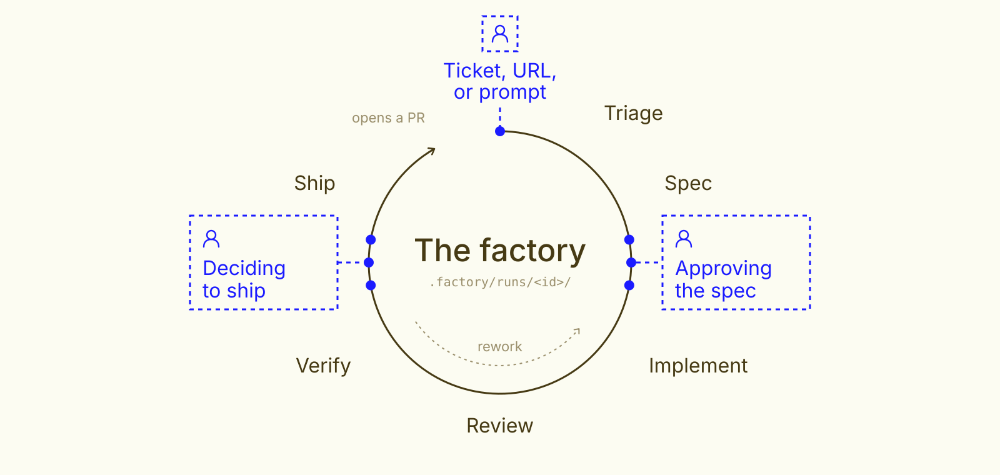

# factory

A software factory workflow for any coding agent that can read the skill and run Git and Python commands. Give it a ticket, URL, or prompt; it triages the request, writes a spec, implements it on a branch, reviews the diff, verifies the acceptance criteria, opens a PR after human approval, and then carries that PR through CI failures and review comments until it merges or closes. It never merges or deploys; merging stays a human's call. Inspired by Warp's [guide to cloud software factories](https://www.warp.dev/blog/a-guide-to-cloud-software-factories-for-engineering-leaders).

```text
<factory> <ticket | URL | prompt>
```

Use your agent's syntax for invoking an installed skill. The factory can dispatch stage subagents when the host supports them; otherwise the orchestrator follows the same stage instructions itself.

## The factory loop



Agents write their outputs to `.factory/runs/<run-id>/`. Each run works in its own Git worktree, so your checkout stays on your branch with your uncommitted changes untouched. At the two approval points, the host presents those outputs to the human and saves the answer in `feedback.md` for the next stage. Review or verification failures return to implementation, then pass through review again. A human can steer when work is blocked. Shipping opens a PR and posts the run report on it. Landing then follows the PR: red CI, merge conflicts, and reviewers' comments go back through implement, review, and verify, and the fix is pushed to the same PR, until the PR is merged or closed.

| Stage | Output | Human decision |
|---|---|---|
| Triage | `triage.md` with resolved input, risks, questions, and verdict | Clarify or override if needed |
| Spec | `spec.md` with testable acceptance criteria, open questions, and diagrams where they help | Checkpoint 1: approve or request a revision; the human may edit `spec.md` directly |
| Implement | Code commits and `implementation.md` | Steer if blocked |
| Review | `review.md` with blocking findings and notes | Findings are shown at checkpoint 2 |
| Verify | `verification.md` and `evidence/`, with a suite result and one result per criterion | Checkpoint 2: inspect evidence, ship, or send work back |
| Ship | Pushed branch, PR, and a PR comment with the spec and evidence | Only after the human says **Ship** |
| Land | `land.md`: the PR's state, CI failures, and review comments sorted into fixes, questions, and things not acted on | Reviewers review and merge; questions come to the human |

Review gets three consecutive attempts; verification gets three attempts between human checkpoints; PR fix rounds get three between human checkpoints. A cap sends the run to checkpoint 2 with the problem stated. Failed verification returns to implementation, then review, then verification. An environment limitation can go straight to checkpoint 2 with the affected criteria named.

## Commands

Replace `<factory>` with your agent's invocation syntax:

```text
<factory> <input>                 Start a run
<factory>                         List runs and their stages
<factory> <run-id>                Resume from the recorded stage; at land, check the PR again
<factory> <run-id> approve        Approve checkpoint 1
<factory> <run-id> ship           Approve checkpoint 2 and create a PR
<factory> <run-id> <feedback>     Request changes, answer a blocked agent, or ask for a PR fix
<factory> <run-id> pause|abort    Pause or abort
```

In an interactive session, the factory uses the host's question UI when available. Otherwise it asks in chat and waits for a reply. It never treats a preselected choice as an answer. Headless runs can pass answers as command arguments and resume from the recorded stage, or take them from GitHub comments; see [Answering from GitHub](#answering-from-github).

`state.json` and its transitions are managed by [`state.py`](.agents/skills/factory/scripts/state.py), which requires Python 3. If shipping cannot push or open a PR, the run remains blocked for human steering and doesn't move on to land.

### Worktrees

`state.py new` creates the run branch from your current branch and checks it out in `.factory/worktrees/<run-id>/`. Agents work only there, so you can keep editing, leave your tree dirty, and start more runs while one waits at a checkpoint. A run starts from the last commit on your branch; uncommitted changes aren't included. The worktree stays while the PR is open, so PR fix rounds can work in it, and is removed when the PR is merged or closed or the run is aborted. The run branch is kept.

A fresh worktree has no installed dependencies, so the implement and verify stages install them the way the repo documents. Most tools skip dot-directories such as `.factory/`; if one of yours scans it, exclude `.factory/` there. To work in your checkout instead, ask for an in-place run (`state.py new --in-place`), which needs a clean tree and switches your checkout to the run branch.

### The PR report

After opening the PR, the factory posts one comment, generated by `state.py pr-report`, so reviewers can see why the change should be trusted without the run folder. It contains a table of each acceptance criterion and its verification result, the review verdict, and rounds used, plus collapsible sections with the approved spec, the verification evidence, the code review, and human feedback. Long files are truncated to fit GitHub's comment limit.

The verify stage drives every UI criterion with a Playwright script. Where the repo has Playwright configured, it reuses that setup, including how the repo starts the app, logs in, and seeds data; otherwise it uses a standalone harness in the run folder. Each script asserts the visible result, takes a numbered screenshot at each key step, and records a video, plus a trace when it fails. `verification.md` gives the command to replay each flow, so you can rerun it at checkpoint 2.

Screenshots and recordings from the verify stage appear inline in the comment, grouped by the criterion in their file name (`AC2-error-banner.png`). Each criterion shows one screenshot, the main flow's final step, and one recording, its `AC<n>-flow` video; earlier steps and edge cases stay in the run folder. They are uploaded with `gh pr comment --attach`, so nothing is committed to the branch; this needs GitHub CLI 2.99 or later and push access to the repository. When `gh` is older, the factory upgrades it before posting; if it can't, or if uploading fails, the comment lists the files by name instead. GitHub's limits apply: 10 MB per image, 100 MB per video, and the factory attaches at most 20 files.

### Landing the PR

Opening the PR doesn't end a run. The land stage reads the PR with `state.py pr-status` and `state.py inbox` and sorts what it finds:

- **Merged or closed:** the run ends as `merged` or `closed`, and its worktree is removed.
- **Fix:** a failing check caused by the change, a merge conflict, or a concrete review comment from someone with write access. The run goes back through implement, review, and verify. Then it pushes to the same PR, without a second ship approval, and posts a short comment saying what it addressed, with the new verification table. Merge conflicts are resolved by merging the base in, never by rebasing or force-pushing.
- **Needs a human:** a question about intent, a design or scope change, reviewers who disagree, or CI that is red on the base branch too. The run stops at `blocked` with one question.
- **Wait:** CI is pending or reviewers haven't spoken. The run stays at `land`. `<factory> <run-id>` checks again. A host that can deliver PR events to the session, like Claude Code on the web, can subscribe instead.

Bot comments are claims to check, not orders, and comments from people without write access are never acted on. After three fix rounds without a human, the run goes to checkpoint 2.

### Answering from GitHub

Every comment the factory posts carries a hidden `<!-- factory` marker, so it never reads its own posts back. People with write access to the repository can answer a checkpoint by commenting `/factory approve`, `/factory ship`, `/factory abort`, or `/factory <feedback>` on the run's PR. If the run started from a GitHub issue, they can answer on the issue too. The next `<factory> <run-id>` picks up the latest answer. To accept answers only from specific people, list their GitHub logins:

```sh
git config factory.approvers 'alice,bob'
```

Before a PR exists, the factory posts checkpoints on the source issue only if you opt in, because the issue may be public:

```sh
git config factory.postCheckpoints true
```

The spec is then posted on the issue for approval, and the ship decision with its verification table. Once the run has a PR, checkpoints are posted there. Reading comments, posting checkpoints, and landing use `gh`. Without it, the factory uses whatever GitHub tooling the host has, under the same trust rules.

### The run ledger

`state.py stats` reports how the factory is doing across runs:

- outcomes and merge rate
- how often the spec and the ship decision are approved without a revision
- loop caps hit
- PR fix rounds per PR
- median time to PR and to merge, and how long runs wait on humans

`state.py stats <run-id>` breaks one run down by stage. When the host reports a subagent's token usage, the orchestrator records it with `state.py usage`, and `stats` adds tokens and cost. `--json` gives machine-readable output.

### Notifications

Set a notify command to hear when a run needs you, or when its PR changes: spec approval, ship approval, a blocked stage, a PR opened or updated with fixes, and a PR merged or closed. The command runs through the shell with the event as JSON on stdin and `FACTORY_RUN_ID`, `FACTORY_STAGE`, and `FACTORY_MESSAGE` in its environment. Set it per repo or globally with `git config`, or with the `FACTORY_NOTIFY` environment variable, which takes precedence:

```sh
# Push to your phone with ntfy.sh
git config --global factory.notify 'curl -s -d "$FACTORY_MESSAGE" ntfy.sh/<your-topic>'
# Post to a Slack incoming webhook
git config --global factory.notify 'curl -s -X POST -H "Content-type: application/json" -d "$(jq -n --arg t "$FACTORY_MESSAGE" "{text: \$t}")" "$SLACK_WEBHOOK_URL"'
# macOS notification
git config --global factory.notify 'osascript -e "display notification \"$FACTORY_MESSAGE\" with title \"factory\""'
```

A failing or slow notify command (30-second limit) prints a warning and never blocks the run. `<factory>` with no arguments lists runs and how long each has been waiting on a human.

## Install

Install with a skills manager that supports your agent, for example:

```sh
npx skills add katiawheeler/factory
```

For a manual install, copy the full [source skill directory](.agents/skills/factory/SKILL.md) into your agent's skill directory and invoke it using that agent's convention. Copy the directory rather than a compatibility symlink. A repo can override a stage with a named `factory-<stage>` agent.

After **Ship** approval, the factory uses an applicable installed PR creation skill by default to open the PR. If none is available, it uses GitHub tooling directly. On resume it checks for an existing PR before creating one, then records the PR URL in the run state.

## Testing and scope

Run `python3 testing/test_state.py` for state helper tests. [`testing/README.md`](testing/README.md) describes harness-specific stub agents and exercised end-to-end paths.

This version does not start runs from webhooks or cron, watch PRs on its own between sessions, or monitor production signals.
